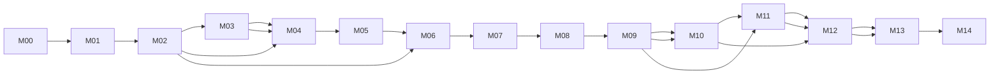

# 01 里程碑规划

## 1. 产品目标

构建一套类似 UE5 的原生优先 3D 游戏引擎：C++20 核心运行时、编辑器、资产烘焙器和游戏框架先面向桌面/主机平台落地；WebAssembly + WebGPU 是裁剪后的发布目标，WebGL2 仅作兼容后端。同时支持大世界和地理空间数据的流式加载，地图、地形、矢量和 3D Tiles 作为插件能力接入。

## 2. 里程碑总览

| 编号 | 名称 | 目标 | 预计出口 |
|---|---|---|---|
| M00 | 工程基线 | CMake/C++20、规范、CI、文档和示例骨架 | 能配置、编译、运行原生空场景 |
| M01 | 最小运行时 | 数学、句柄、ECS、场景、时钟、输入 | 能创建实体并稳定更新 |
| M02 | 原生渲染核心 | RHI、Null、Vulkan、D3D12 规划和清屏三角形 | 原生后端可按能力选择 |
| M03 | 资产与材质 | glTF、纹理、材质、缓存和占位资源 | 能加载 PBR 模型 |
| M04 | 世界流式 | TileKey、四叉树、LOD、Worker、缓存 | 能连续移动并流式显示世界 |
| M05 | 游戏运行时 | 物理、动画、粒子、音频、脚本 | 能运行一个可交互样例 |
| M06 | 编辑器与调试 | 场景编辑器、Inspector、性能面板 | 能编辑、保存和回放场景 |
| M07 | 原生生产质量 | 跨平台兼容、性能、崩溃诊断、安装包和文档 | 达到首个原生公开预览版本 |
| M08 | 扩展生态 | 原生插件 SDK、3D Tiles、矢量和网络接口 | 第三方可开发扩展 |
| M09 | 椭球地球 | WGS84 椭球、ECEF、经纬高和地球四叉树 | 能稳定浏览完整地球 |
| M10 | DEM 高程 | 高程读取、地形网格、法线、LOD 和 GPU 缓冲池 | 能加载带高程地形 |
| M11 | GIS 图层 | 图层栈、格式注册、SHP/GeoJSON/影像适配 | 多图层可叠加显示 |
| M12 | 矢量白膜 | 建筑拉伸、投影转换、三角化和矢量拾取 | 能显示可交互白膜城市 |
| M13 | 地球级可视化质量 | 原点重定位、深度、接缝、相机和动画 | 近地/远地切换稳定 |
| M14 | 第二季性能与示例 | 对象池、批处理、基准、扩展 SDK、原生示例和 Web 样例 | 发布第二季预览版 |

## 3. 里程碑详细任务

## 3.1 建议排期与并行泳道

以下是单个小型核心团队（2～4 人）的粗略排期，用于容量规划，不作为硬承诺：

| 阶段 | 建议周期 | 主泳道 | 可并行泳道 |
|---|---:|---|---|
| M00 | 1～2 周 | CMake 工程、测试入口、跨平台构建 | 文档和示例设计 |
| M01 | 3～4 周 | 数学、ECS、场景、循环 | 输入回放、序列化迁移 |
| M02 | 4～6 周 | RHI、Vulkan、WebGPU 端口 | D3D12/Metal 研究、Shader 约定、渲染测试 |
| M03 | 3～4 周 | 资源、glTF、纹理、缓存 | 资产命令行工具 |
| M04 | 4～6 周 | 四叉树、LOD、Worker 流式 | Web Mercator、断网测试 |
| M05 | 4～6 周 | 物理、动画、粒子、音频 | 脚本和样例玩法 |
| M06 | 3～5 周 | 编辑器、调试和回放 | 导入器和工具链 |
| M07 | 2～3 周 | 兼容、性能、发布 | 文档站和示例站 |
| M08 | 持续迭代 | 插件 SDK、GIS、网络 | 社区扩展和生态验证 |

并行规则：M01 完成句柄、数学和场景契约后，M02/M03 可以分工推进；M04 必须等待 RHI 的上传队列和资产句柄稳定；M05/M06 不应在核心 API 仍频繁变更时大规模展开。

## 3.2 每个里程碑的固定交付包

每个里程碑结束时必须同时提交：

- 设计文档变更和 ADR（如有）。
- 可运行示例或最小复现。
- 自动化测试和一份人工验证记录。
- 性能/兼容性数据（适用时）。
- 未完成项、风险和下一阶段入口条件。

### M00 工程基线

范围：`F01` 工程基础设施、`F10` 文档。

关键任务：

- `T-BASE-001` 建立 CMake 工程、C++20 模块边界和依赖锁定。
- `T-BASE-002` 建立 clang-format、clang-tidy、CTest、Sanitizer 和 CI。
- `T-BASE-003` 创建 native-sandbox、terrain-demo、editor 三个原生应用壳。
- `T-BASE-004` 建立 Emscripten/Web 构建预设、版本、变更日志和 ADR 流程。

出口条件：新环境按文档即可配置并启动 native-sandbox；CI 能完成 C++ 编译、单元测试、静态检查和最小 Web 构建。

### M01 最小运行时

范围：`F02` 数学、`F03` ECS、`F04` 场景、`F05` 输入与时间。

关键任务：

- `T-MATH-001` 向量、矩阵、四元数、包围体和射线。
- `T-CORE-001` 稳定实体句柄和代数校验。
- `T-ECS-001` 组件存储、查询和系统调度。
- `T-SCENE-001` Transform 层级和场景序列化。
- `T-LOOP-001` 固定步长模拟和可变步长渲染。
- `T-INPUT-001` 键鼠、触摸、手柄和输入映射。

出口条件：在无渲染设备环境下也能运行确定性 ECS 测试；相机射线和场景保存/恢复测试通过。

### M02 原生渲染核心

范围：`F06` RHI、`F07` Vulkan、`F08` WebGPU/WebGL2、`F09` RenderGraph。

关键任务：

- `T-RHI-001` 定义设备、缓冲区、纹理、采样器、管线和命令接口。
- `T-VK-001` 实现 Vulkan 初始化、能力探测、交换链和设备丢失处理。
- `T-WGPU-001` 实现 Emscripten WebGPU 初始化、能力探测和设备丢失恢复。
- `T-WEBGL-001` 实现 WebGL2 受限兼容后端。
- `T-RENDER-001` 实现深度、Opaque、透明和 UI 合成通道。
- `T-SHADER-001` 建立跨后端 Shader 中间描述、离线编译、反射和变体缓存。

出口条件：同一场景在 Vulkan 和 WebGPU 均能显示；WebGPU 不可用时可选择 WebGL2 兼容包并给出能力差异诊断。D3D12 后端在接口冻结后加入，不阻塞首个垂直切片。

### M03 资产与材质

范围：`F11` 资产系统、`F12` 材质系统。

关键任务：

- `T-ASSET-001` 资源句柄、引用计数和生命周期。
- `T-ASSET-002` glTF/GLB 加载与 Meshopt/Draco 解码。
- `T-TEX-001` KTX2/Basis 纹理解码、上传和 mip 生成。
- `T-MAT-001` PBR 材质和材质实例。
- `T-CACHE-001` GPU 内存预算、LRU 驱逐和持久化缓存。

出口条件：加载一个带动画和 PBR 纹理的 GLB；重复打开场景不重复下载已缓存资源。

### M04 世界流式

范围：`F13` 空间参考、`F14` 四叉树和 LOD、`F15` 流式调度。

关键任务：

- `T-WORLD-001` TileKey、TileSource 和 TilePayload 契约。
- `T-WORLD-002` 视锥裁剪、SSE 和父瓦片降级。
- `T-WORLD-003` C++ 任务系统解码和渲染线程 GPU 上传队列；Web 端映射到 Worker。
- `T-WORLD-004` 纹理/网格瓦片缓存和并发预算。
- `T-WORLD-005` Web Mercator 插件和局部坐标重定位。

出口条件：相机连续移动 5 分钟无主线程长任务；瓦片失败、取消和断网均有可见降级。

### M05 游戏运行时

范围：`F16` 物理、`F17` 动画、`F18` 粒子、`F19` 音频、`F20` 脚本。

关键任务：

- `T-PHYS-001` 接入支持 C++/WASM 双目标的物理后端和角色控制器。
- `T-ANIM-001` 动画剪辑、状态机和蒙皮。
- `T-PARTICLE-001` CPU 粒子和可选 Compute 粒子。
- `T-AUDIO-001` 音频资源、空间音频和混音总线。
- `T-SCRIPT-001` 沙箱脚本接口和生命周期。

出口条件：完成一个可操作角色样例；物理、动画、音频在暂停/恢复和场景切换后无资源泄漏。

### M06 编辑器与调试

范围：`F21` 编辑器、`F22` 可观测性。

关键任务：

- `T-EDITOR-001` 场景树、Inspector、Gizmo 和撤销重做。
- `T-EDITOR-002` 资源浏览器和导入错误面板。
- `T-DEBUG-001` CPU/GPU 时间、Draw Call、显存和流式队列面板。
- `T-DEBUG-002` GPU 标记、截图和帧捕获导出。

出口条件：编辑器能打开、修改、保存和重新加载一个演示场景；问题可通过面板定位到资源或任务。

### M07 原生生产质量与 Web 发布

关键任务：

- `T-QA-001` 操作系统/显卡/RHI/浏览器兼容矩阵和自动化冒烟测试。
- `T-PERF-001` 桌面、Web、低端设备和大世界基准。
- `T-WEB-001` Emscripten 链接、JavaScript 宿主、线程和虚拟文件系统适配。
- `T-COOK-001` 资产烘焙、分块包、内容哈希和增量发布。
- `T-RELEASE-001` 原生安装包、Web 静态产物、SDK 和 API 文档发布。

出口条件：达到性能预算，关键功能有回归测试，版本可回滚。

### M08 扩展生态

关键任务：

- `T-PLUGIN-001` 插件 SDK 稳定版和版本兼容策略。
- `T-GIS-001` 3D Tiles 和 GeoJSON/矢量扩展。
- `T-NET-001` 网络同步抽象，不绑定具体服务商。
- `T-PLATFORM-001` 固化 Windows/Linux/macOS/Web 平台能力契约和裁剪规则。

### M09 椭球地球

范围：`F23` 地球椭球与空间参考。

关键任务：

- `T-EXT-GEO-001` 冻结坐标、角度、椭球参数和轴约定。
- `T-EXT-GEO-002` 实现 WGS84 经纬高与地心地固坐标（ECEF）互转。
- `T-EXT-GEO-003` 实现局部东-北-天（ENU）坐标和相切参考系。
- `T-EXT-GEO-004` 将地球四叉树边界从平面矩形升级为曲面包围体。

出口条件：可在全球范围旋转、缩放、定位，近地模型无明显抖动，跨经度边界连续。

### M10 DEM 高程

范围：`F24` DEM 高程地形。

关键任务：

- `T-EXT-DEM-001` 定义高程字段、无数据值和垂直基准。
- `T-EXT-DEM-002` 实现 DEM 解码器和高程瓦片读取。
- `T-EXT-DEM-003` 实现规则网格/量化网格地形生成。
- `T-EXT-DEM-004` 实现法线、边缘裙边和相邻 LOD 过渡。
- `T-EXT-DEM-005` 实现高程瓦片分裂、级联更新和 GPU 缓冲池。

出口条件：影像与 DEM 对齐，切换 LOD 不出现明显裂缝或高度跳变。

### M11 GIS 图层

范围：`F25` 图层栈与格式系统。

关键任务：

- `T-EXT-LAYER-001` 设计影像、DEM、矢量、模型和注记图层契约。
- `T-EXT-LAYER-002` 实现图层栈、可见性、顺序和时间过滤。
- `T-EXT-FMT-001` 实现格式注册、版本协商和任务系统解码适配。
- `T-EXT-FMT-002` 接入 SHP、GeoJSON、PNG/JPEG、KTX2 和 FEPK 适配器。

出口条件：至少三类图层可叠加，单一格式失败不会影响其他图层。

### M12 矢量白膜

范围：`F26` 矢量要素与白膜建筑。

关键任务：

- `T-EXT-VEC-001` 定义 Feature、Point、Line、Polygon、Building 数据模型。
- `T-EXT-VEC-002` 实现投影转换和局部坐标归一化。
- `T-EXT-VEC-003` 实现凹多边形三角化和建筑拉伸。
- `T-EXT-VEC-004` 实现 Geometry/Node/Primitive 渲染抽取。
- `T-EXT-VEC-005` 实现属性着色、要素 ID 和矢量拾取。

出口条件：可加载城市边界/建筑数据，支持按属性着色、点击选择和批量绘制。

### M13 地球级可视化质量

范围：`F27` 精度、深度、交互和动画。

关键任务：

- `T-EXT-PREC-001` 实现相机相对坐标、原点重定位和双精度拆分。
- `T-EXT-PREC-002` 评估反向 Z、对数深度和 WebGL2 备用路径。
- `T-EXT-INT-001` 实现地球轨道、平移、缩放和惯性相机。
- `T-EXT-INT-002` 实现地形/矢量/模型统一拾取。
- `T-EXT-ANIM-001` 实现相机动画、飞行动画和中断恢复。

出口条件：远地球、近地表和建筑场景连续切换；交互在鼠标、触摸和键盘上行为一致。

### M14 第二季性能与示例

范围：`F28` 性能基础设施、示例和 SDK。

关键任务：

- `T-EXT-PERF-001` 实现实体、瓦片、几何和任务对象池。
- `T-EXT-PERF-002` 实现实例化、间接绘制和批处理统计。
- `T-EXT-PERF-003` 建立全球地球、城市白膜和 DEM 基准场景。
- `T-EXT-SDK-001` 固化空间参考、图层、格式和渲染插件 API。
- `T-EXT-REL-001` 发布第二季迁移指南和兼容性报告。

出口条件：第二季演示场景可一键运行，达到性能预算，插件可独立注册和卸载。

## 4. 依赖关系

M01、M02 是硬依赖；M03 与 M04 可在 M02 完成基础接口后并行；M05、M06 可以在 M03/M04 稳定后并行推进。

## 5. 版本策略

- `0.x`：允许接口演进，重点验证架构。
- `1.0`：C++ 核心运行时、至少两个原生 RHI、WebGPU 发布后端、资产、流式和插件 API 冻结。
- `1.x`：新增能力只扩展接口，不破坏已有场景和资源格式。
